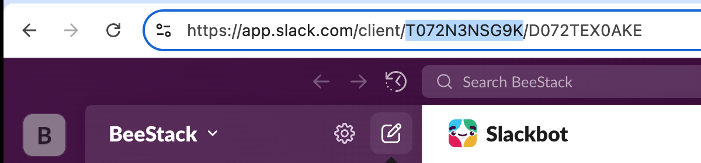

# Slack app

You can add the CrawlChat **Slack app** to your Slack workspace and your community, team, clients can just tag the bot and ask questions. Example, `@crawlchat` how to install it?

## Setup

Here is the step by step procedure of adding the Slack app to your workspace

1. Go to Slack app [installation page](https://slack.crawlchat.app/install)
2. Follow the installation procedure and install it to your workspace
3. Open Slack and go to the `channel` you want it to respond
4. Add the app to the channel
5. Copy the team id (should be there in the URL of slack web version) and paste it [here](https://crawlchat.app/connect/slack#slack-team-id)
6. Save it

### 3. Configure

You can configure follwing items for the Slack app

- `Broadcast the reply` By default the app replies to the asked message. You can enable it to broadcast the reply from [here](https://crawlchat.app/connect/slack#broadcast)
